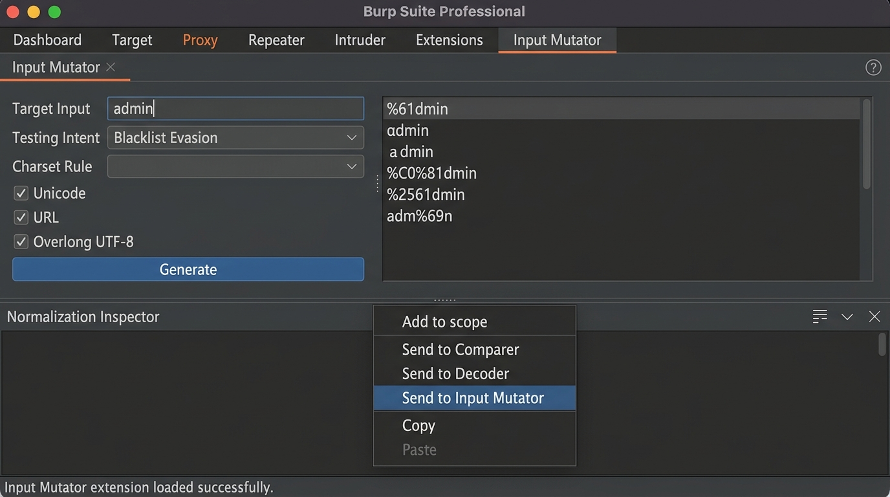
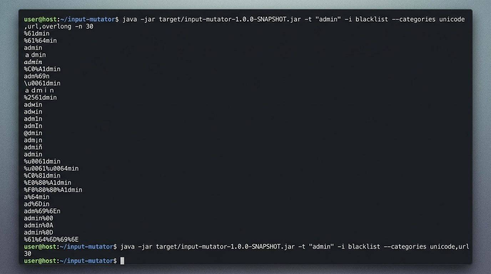

# Input Mutator

[](https://github.com/YOUR_USERNAME/YOUR_REPO/actions/workflows/ci.yml)

A constraint-guided input permutation engine for application security testing, written in Java 21. It produces structured, parser-aware mutations rather than the noise you get from naive fuzzers — useful for whitelist auditing, blacklist evasion, and catching proxy/backend normalization desync.

Ships as a single fat JAR that runs in three modes:

1. **Burp Suite Extension** — native suite tab, Repeater/Proxy context-menu action, and a custom Intruder payload generator
2. **Desktop GUI** — Swing interface with live normalization inspection, intent presets, and per-category toggles
3. **CLI** — pipe-friendly headless mode for wordlist generation and CI/CD integration

**Desktop GUI** — Blacklist Evasion mode with live Normalization Inspector:


**Burp Suite Extension** — native suite tab and Send to Input Mutator context menu:


**CLI** — piping mutations to a wordlist:


---

## Quick Start

### Option A — Download the JAR (no build required)

Download the latest `input-mutator-1.0.0-SNAPSHOT.jar` from the [Releases](../../releases) page. You only need a JDK to run it.

**Install JDK 21 if you don't have it:**

- **Windows**: Download from [Adoptium](https://adoptium.net/) and run the installer. Tick "Set JAVA_HOME" during setup.
- **macOS**: `brew install --cask temurin@21`
- **Linux (Debian/Ubuntu)**: `sudo apt install temurin-21-jdk` (add [Adoptium's apt repo](https://adoptium.net/installation/linux/) first)
- **Linux (Fedora/RHEL)**: `sudo dnf install java-21-openjdk`

Verify your install: `java -version` should show `21.x.x`.

**Run the GUI:**
```bash
# Windows
run-gui.bat

# macOS / Linux
./run-gui.sh

# Any platform
java -jar input-mutator-1.0.0-SNAPSHOT.jar
```

**Run the CLI:**
```bash
java -jar input-mutator-1.0.0-SNAPSHOT.jar -t "admin" -i blacklist -n 50
```

**Load as a Burp Suite extension:**
1. Burp Suite > **Extensions** > **Installed** > **Add**
2. Extension type: `Java`
3. Select the JAR and click **Next**

---

### Option B — Build from source

You'll need JDK 21+ and Maven 3.8+.

**Install Maven:**
- **Windows**: `winget install Apache.Maven` or [download from Maven site](https://maven.apache.org/download.cgi) and add `bin/` to PATH
- **macOS**: `brew install maven`
- **Linux**: `sudo apt install maven` / `sudo dnf install maven`

```bash
git clone https://github.com/YOUR_USERNAME/YOUR_REPO.git
cd YOUR_REPO
mvn clean test package
```

The built JAR lands at `target/input-mutator-1.0.0-SNAPSHOT.jar`.

---

## Why Input Mutator?

Most permutation tools either produce malformed byte sequences that get rejected at the network edge, or they require heavy third-party runtimes. Input Mutator takes a different approach — it understands the structure of what it's mutating.

- **Intent-driven**: pick a testing intent and the engine selects the right mutation strategies automatically
  - `whitelist` — tests boundary enforcement by probing what a strict allowlist should reject
  - `blacklist` — obfuscates keywords and delimiters to evade signature-based filters
  - `differential` — targets proxy/backend normalization gaps using delimiter ambiguity and grammar variations
- **Category control**: toggle specific mutation categories (`unicode`, `url`, `overlong`, `html`, `radix`, `grammar`, `control`) independently or let the intent preset configure them
- **Encoding composition**: mutations flow through a 3-stage pipeline — character mutation, representation encoding, then transport percent-encoding — controlled via `--encoding-layers`
- **Character set constraints**: lock output to `any`, `ascii`, `alphanumeric`, or `printable` to stay in-scope
- **Semantic tokenization**: input is parsed as a URL, email, JSON, numeric value, or generic string — mutations respect structural boundaries by default
- **Sliding-window and combinatorial modes**: mutate one character position at a time (`single`) or permute multiple positions simultaneously (`combinatorial`)
- **Natural exhaustion**: pass `-n 0` to run until the state graph is exhausted rather than capping at a fixed count
- **Pre-encoded input handling**: detects and canonicalizes existing URL/HTML/Unicode escapes before mutating
- **Zero-input seed generation**: omit the target and the engine synthesizes boundary archetypes for the specified data type
- **Live normalization inspector**: see how any selected mutation decodes under URL decode, NFKC normalization, and HTML unescaping side-by-side
- **No third-party runtime dependencies**: pure Java 21 standard library

---

## Mutation Categories

| Category | What it generates |
| :--- | :--- |
| **`grammar`** | URL matrix parameters (`/;param=1/`), IIS trailing dots (`/.`), dot-segment normalization (`/./`, `/..;/`), RFC 5322 email comment wrapping (`admin(test)@domain.com`), quoted local-parts, sub-addressing (`admin+tag@`), raw Unicode JSON key escapes |
| **`unicode`** | NFC/NFD/NFKC/NFKD decompositions, NFKC singletons (Kelvin sign `\u212A` -> `K`, long-s `\u017F` -> `s`), Cyrillic/Greek confusables, Turkish case variants (`\u0131`, `\u0130`), fullwidth ASCII, mathematical alphanumeric alphabets |
| **`url`** | Percent-encoding (uppercase/lowercase hex), multi-layer double and triple encoding (`%252F`, `%25252F`) |
| **`overlong`** | 2-byte and 3-byte overlong UTF-8 for ASCII characters (`/` -> `%C0%AF`, `%E0%80%AF`) |
| **`html`** | Zero-padded decimal and hex entities (`&#00000047;`, `&#x0000002F;`), named entities (`&sol;`, `&quot;`) |
| **`radix`** | Hex (`0x`), octal (`0o`, `0`), binary (`0b`), scientific notation, float edge cases (`NaN`, `Infinity`, `-0.0`), 32/64-bit integer boundaries, fullwidth digits, Arabic-Indic digits |
| **`control`** | Zero-width spaces (`\u200B`), soft hyphens (`\u00AD`), zero-width joiners, C0/C1 control codes, lone surrogates, null bytes (`\0`, `%00`) |

---

## Granularity Modes

- **`token`** (default) — transforms whole parsed token slices at once with fair round-robin scheduling
- **`single`** — sliding-window: mutates one character position at a time across the input (e.g., `admin` -> `%61dmin`, `a%64min`, `ad%6Dmin`)
- **`combinatorial`** — permutes multiple character positions simultaneously, up to `--max-positions` (1–4), without combinatorial starvation

---

## CLI Reference

```
Core Options:
  -t, --target <string>       Input to mutate (optional — omit to generate seed vectors)
  --type <type>               Input semantics: generic, numeric, json, email, url, phone
  -i, --intent <intent>       Testing intent: whitelist, blacklist (default), differential
  -c, --charset <charset>     Output character constraint: any (default), ascii, alphanumeric, printable
  --categories <cat1,cat2>    Categories to enable: unicode, url, overlong, html, radix, grammar, control
  -g, --granularity <mode>    Granularity: token (default), single, combinatorial
  --max-positions <n>         Simultaneous positions in combinatorial mode (1–4, default: 2)
  --encoding-layers <n>       Nested encoding depth (1–3, default: 1)
  -n, --max-permutations <n>  Output cap — 0 means run to natural exhaustion (default: 150)
  --max-depth <n>             Max recursive transformation depth (default: 2)

Boundary Flags:
  --allow-non-printable       Emit raw C0/C1 control codes and lone surrogates
  --allow-null-bytes          Emit raw NUL bytes
  --no-canonicalize           Skip auto-canonicalization of pre-encoded inputs
  --no-preserve-structure     Allow mutations to cross semantic delimiter boundaries
```

### Examples

```bash
# Whitelist audit — what slips through an alphanumeric-only filter?
java -jar input-mutator-1.0.0-SNAPSHOT.jar -t "admin" -i whitelist -c alphanumeric

# Blacklist evasion — unicode and overlong variants of a path traversal sequence
java -jar input-mutator-1.0.0-SNAPSHOT.jar -t "../secret" -i blacklist --categories unicode,url,overlong

# Parser differential — normalization desync vectors for a URL path
java -jar input-mutator-1.0.0-SNAPSHOT.jar -t "/api/v1/users" --type url -i differential -n 50

# Seed generation — boundary test vectors for email parsers, no input required
java -jar input-mutator-1.0.0-SNAPSHOT.jar --type email -n 25

# Sliding-window — mutate one character at a time across all positions
java -jar input-mutator-1.0.0-SNAPSHOT.jar -t "admin" -g single -n 30

# Pipe all mutations to a wordlist file
java -jar input-mutator-1.0.0-SNAPSHOT.jar -t "admin" -i blacklist -n 0 > wordlist.txt
```

---

## Burp Suite Integration

1. Build the JAR or download it from [Releases](../../releases)
2. In Burp Suite: **Extensions** > **Installed** > **Add** > Extension type: `Java` > select the JAR
3. The extension registers three integration points:
   - **Suite Tab** — the full GUI and normalization inspector inside Burp
   - **Context Menu** — highlight any value in Repeater or Proxy, right-click, select **Send to Input Mutator**
   - **Intruder Payload Generator** — in any Intruder attack, set payload type to `Extension-generated` and select **Input Mutator - Constraint Engine**
