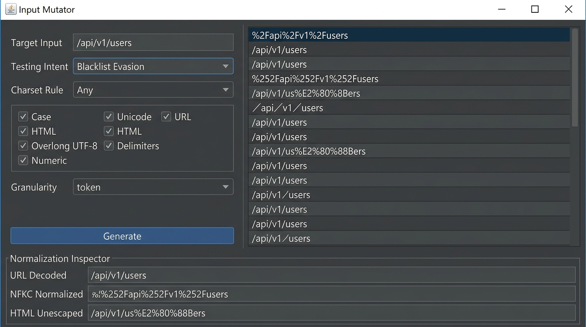

# Input Mutator

[](https://github.com/YOUR_USERNAME/YOUR_REPO/actions/workflows/ci.yml)

A lightweight, constraint-guided input permutation engine written in Java 21. Designed for application input validation testing, parser boundary analysis, and differential compliance verification without the noise of naive random fuzzers.

Runs in three modes from a single fat JAR:
1. **Burp Suite Montoya Extension**: Native suite tab, Repeater/Proxy context-menu action, and custom Intruder payload generator.
2. **Standalone Desktop GUI**: Swing interface with live differential parser simulation, intent presets, artifact toggles, and an embedded reference guide.
3. **Headless CLI**: Command-line tool built for shell piping, automated seed generation, and CI/CD validation pipelines.



---

## Why Input Mutator?

Most test permutation tools either emit malformed byte sequences rejected at the network edge or carry heavy third-party runtimes.

Input Mutator takes a structured, parser-aware approach:
* **Intent-Driven Context**: Direct your audit using explicit testing intents:
  * **`whitelist`** (`WHITELIST_AUDITING`): Tests downstream expansion against strict character and format specifications.
  * **`blacklist`** (`BLACKLIST_EVASION`): Obfuscates forbidden keywords and delimiters to evade signature filters.
  * **`differential`** (`PARSER_DIFFERENTIAL`): Targets proxy/backend normalization desync via delimiter ambiguity, matrix parameters, and grammar variations.
* **Selectable Artifact Categories**: Granularly toggle vector categories (`unicode`, `url`, `overlong`, `html`, `radix`, `grammar`, `control`) or let intent presets select optimal baselines.
* **Cross-Artifact Composition Layering**: 3-step structured composition (`Character Mutation` $\rightarrow$ `Representation Encoding` $\rightarrow$ `Transport %-Encoding`) governed by `--encoding-layers`.
* **Declarative Character Set Constraints**: Enforce strict character boundaries (`any`, `ascii`, `alphanumeric`, `printable`) to audit whitelist enforcement and prevent out-of-scope mutations.
* **Context & Semantic Awareness**: Tokenizes inputs according to protocol and format rules (URL, Email, JSON, Numeric, or Generic text) to test parser differentials while preserving syntactic validity.
* **Granular Sliding-Window & Combinatorial Modes**:
  * Character-level sliding-window permutations (`single`) test edge cases one index at a time across all positions.
  * Multi-position combinations (`combinatorial`) test heterogeneous permutations across token subsets without combinatorial starvation.
* **Natural Exhaustion**: Setting `-n 0` (or `maxPermutations <= 0`) runs graph traversal to its natural mathematical boundary safely bounded by visited-state tracking.
* **Pre-Encoded Auto-Detection & Canonicalization**: Detects URL, HTML, Unicode, and Hex escapes upfront and canonicalizes before applying mutations.
* **Zero-Input Archetype Generation**: When target input is omitted, the engine synthesizes curated boundary test vectors tailored to the target data type.
* **Live Normalization Inspection**: Side-by-side inspection showing how mutations decode under URL decode, Unicode NFKC normalization, and HTML unescaping in real time.
* **Zero Third-Party Runtime Dependencies**: Built entirely on Java 21 standard libraries.

---

## Mutation Matrix & Artifact Categories

| Category | Artifacts & Edge Cases Targeted |
| :--- | :--- |
| **`grammar`** (Grammar & Differentials) | URL path matrix parameters (`/;param=1/`, `;\jsessionid=0`), IIS trailing dots (`/.`), dot-segment normalization (`/./`, `/..;/`), RFC 5322 email comment wrapping (`admin(test)@domain.com`), quoted local-parts (`"admin"@domain.com`), sub-addressing (`admin+tag@`), and raw Unicode JSON key escapes (`"\u0061dmin"`). |
| **`unicode`** (Unicode & Homoglyphs) | NFC/NFD accents, NFKC/NFKD compatibility decompositions, NFKC singletons (Kelvin sign `\u212A` $\rightarrow$ `K`, feminine ordinal `\u00AA` $\rightarrow$ `a`, long-s `\u017F` $\rightarrow$ `s`), Cyrillic/Greek confusables, Turkish locale-sensitive case variants (`\u0131`, `\u0130`), fullwidth ASCII, and mathematical alphanumeric alphabets. |
| **`url`** (URL Encodings) | URL percent-encoding (uppercase/lowercase) and multi-layer nested percent-encoding (`%252F`, triple `%25252F`). |
| **`overlong`** (Overlong UTF-8) | 2-byte and 3-byte overlong UTF-8 representations for ASCII tokens (e.g., `/` $\rightarrow$ `%C0%AF`, `%E0%80%AF`). |
| **`html`** (HTML Entities) | Overlong zero-padded decimal and hex HTML entities (`&#00000047;`, `&#x0000002F;`), named entities (`&sol;`, `&quot;`). |
| **`radix`** (Numeric & Radices) | Hexadecimal (`0x`), modern/legacy octal (`0o`, `0`), binary (`0b`), scientific notation (`1e3`, `1.5E-2`), floating-point edge cases (`.5`, `-0.0`, `NaN`, `Infinity`), 32/64-bit integer boundaries, Unicode fullwidth digits, and Arabic-Indic cultural digits. |
| **`control`** (Controls & Invisibles) | Zero-width spaces (`\u200B`), soft hyphens (`\u00AD`), zero-width joiners (`\u200C`, `\u200D`), word joiners (`\u2060`), C0/C1 control codes, lone surrogates, and null byte sequences (`\0`, `\x00`, `%00`). |

---

## Granularity Modes

* **`token` (Default)**: Transforms whole token slices at once using fair round-robin scheduling across mutator categories.
* **`single` (Sliding Window)**: Iterates through each character position in the candidate token, mutating one index at a time (e.g., `admin` $\rightarrow$ `%61dmin`, `a%64min`, `ad%6Dmin`).
* **`combinatorial`**: Symmetrically permutes multi-character subsets using heterogeneous mutators up to `--max-positions` (1-4) without starvation.

---

## Prerequisites & Build

* **Java**: JDK 21+
* **Maven**: 3.8+

Compile, run all unit tests, and build the shaded fat JAR:

```bash
mvn clean test package
```

The executable JAR is generated at:
```
target/input-mutator-1.0.0-SNAPSHOT.jar
```

---

## CLI Usage & Options

```text
Core Options:
  -t, --target <string>       Input target string to mutate (optional if generating seeds)
  --type <type>               Input semantics [generic, numeric, json, email, url, phone]
  -i, --intent <intent>       Testing intent [whitelist, blacklist (default), differential]
  -c, --charset <charset>     Character set constraint [any (default), ascii, alphanumeric, printable]
  --categories <cat1,cat2>    Comma-separated categories [unicode, url, overlong, html, radix, grammar, control]
  -g, --granularity <mode>    Mutation granularity [token (default), single, combinatorial]
  --max-positions <n>         Max simultaneous positions in combinatorial mode (1-4, def: 2)
  --encoding-layers <n>       Max nested encoding layers for escapes (1-3, def: 1)
  -n, --max-permutations <n>  Maximum unique mutations to output (0 = unlimited, default: 150)
  --max-depth <n>             Max recursive transformation depth (default: 2)

Boundary Flags:
  --allow-non-printable       Allow unescaped C0/C1 control codes and lone surrogates
  --allow-null-bytes          Allow raw unescaped NUL (\0) bytes
  --no-canonicalize           Disable auto-canonicalization of pre-encoded inputs
  --no-preserve-structure     Allow mutations to break semantic delimiter boundaries
```

### CLI Examples

```bash
# 1. Whitelist Auditing (test strict ASCII alphanumeric boundary with 0 or provided input)
java -jar target/input-mutator-1.0.0-SNAPSHOT.jar -t "admin" -i whitelist -c alphanumeric

# 2. Blacklist Evasion with targeted categories
java -jar target/input-mutator-1.0.0-SNAPSHOT.jar -t "../secret" -i blacklist --categories unicode,url,overlong

# 3. Parser Differential Analysis (URL path normalization & desync vectors)
java -jar target/input-mutator-1.0.0-SNAPSHOT.jar -t "/api/v1/users" --type url -i differential -n 50

# 4. Zero-Input Archetype Generation (boundary vectors for email parsers)
java -jar target/input-mutator-1.0.0-SNAPSHOT.jar --type email -n 25

# 5. Sliding-window keyword filter testing (1 char at a time across all positions)
java -jar target/input-mutator-1.0.0-SNAPSHOT.jar -t "admin" -g single -n 30

# 6. Uncapped Natural Exhaustion (pipe all valid graph mutations to a wordlist)
java -jar target/input-mutator-1.0.0-SNAPSHOT.jar -t "admin" -i blacklist -n 0 > wordlist.txt
```

---

## Desktop GUI & Burp Suite Integration

### Standalone Desktop GUI
Launch using the automated scripts or JAR:
* **Windows**: Run `run-gui.bat` (auto-discovers JDK 21+ installations).
* **Linux / macOS**: Run `./run-gui.sh`.
* **Direct**: `java -jar target/input-mutator-1.0.0-SNAPSHOT.jar`

**GUI Controls**:
* **Testing Intent**: Select Whitelist Auditing, Blacklist Evasion, or Parser Differential to automatically populate recommended vector categories.
* **Charset Rule**: Restrict permutations to Any, ASCII Only, Alphanumeric, or Printable ASCII.
* **Artifact Checkboxes**: Toggle individual categories (`Case`, `Unicode`, `URL`, `HTML`, `Overlong UTF-8`, `Delimiters`, `Numeric`).
* **Differential Normalization Inspector**: Select any generated permutation to inspect its URL-decoded, Unicode NFKC normalized, and HTML unescaped forms in real time without UI freezing.

### Burp Suite Extension
1. In **Burp Suite**, navigate to **Extensions** > **Installed** > **Add**.
2. Select **Extension type**: `Java`.
3. Choose `target/input-mutator-1.0.0-SNAPSHOT.jar` and click **Next**.

**Burp Integrations**:
* **Suite Tab**: Dedicated tab hosting the complete Desktop GUI and live inspector.
* **Context Menu**: Highlight any parameter in Repeater or Proxy, right-click, and select **Send to Input Mutator** (automatically focuses the Input Mutator tab).
* **Burp Intruder Custom Payload Generator**: In Intruder attacks, select `Payload type: Extension-generated` > `Input Mutator - Constraint Engine` to stream mutations into attack positions.

